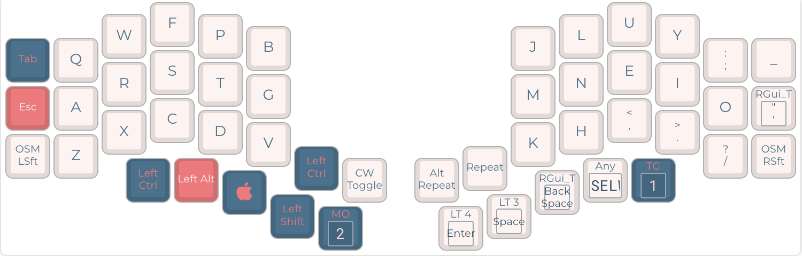
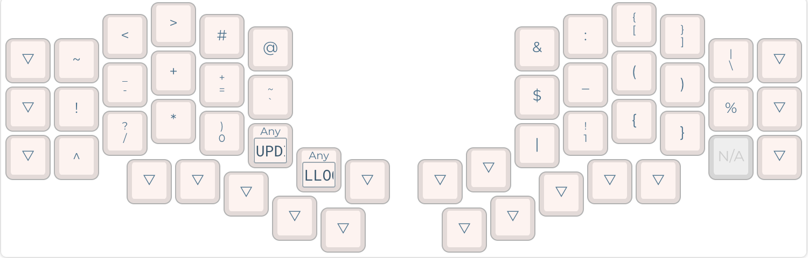
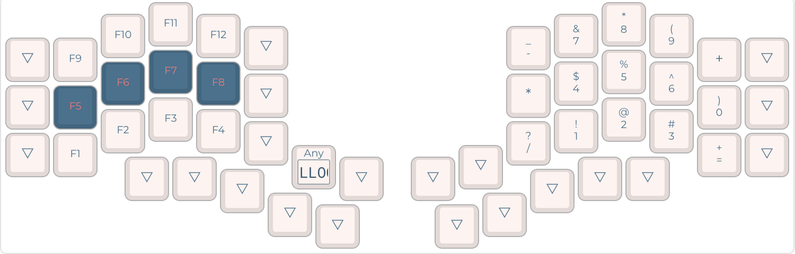
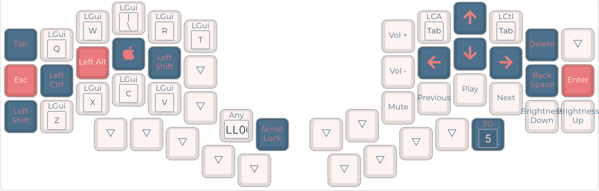
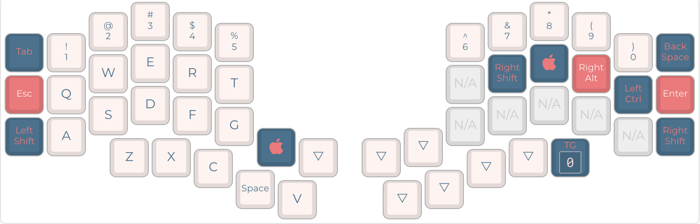
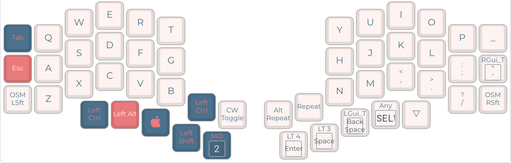

# Kyria Keymap

This is my keymap for the [Kyria rev3](https://github.com/splitkb/kyria). 

It was heavily inspired by [Pascal Getreuer's keymap](https://github.com/getreuer/qmk-keymap). It uses a `Colemak-DH` base layer with an option to switch to `Qwerty`. I spent a lot of time trying to design a very efficient symbol layer for programming. To do so, I referred heavily to character and bigram frequencies in programming langues.

The keymap is compiled using a GitHub Action. I changed the target to `-e CONVERT_TO=liatris` in the GitHub Action since adding it in `rules.mk` did not work for me. If you have a [different controller](https://docs.qmk.fm/#/feature_converters?id=converters), you might want to remove this part in `build.yml`. 

## Features

- [Caps Word](https://docs.qmk.fm/#/feature_caps_word)
- [Repeat Key](https://docs.qmk.fm/#/feature_repeat_key)
- [Word Selection](https://getreuer.info/posts/keyboards/select-word/index.html) macro
- [Layer Lock](https://getreuer.info/posts/keyboards/layer-lock/index.html) macro
- `../` key in symbol layer
- Layer keys activated by the thumbs via mod-tap.
- TBD: Home row mods?

## Layers

These layers are still in the early stages of development.

### `Colemak-DH` base layer

### Symbol layer 

Optimized for coding including `0` and `1`.

### Numpad layer

### Navigation layer 

Adapted the [Extend Layer](https://dreymar.colemak.org/layers-extend.html) for MacOS.

### Gaming layer 

Numbers and `qwerty` row. Command keys on the right side if needed.

### Alternate `Qwerty` layer

Option to switch to `Qwerty`.

