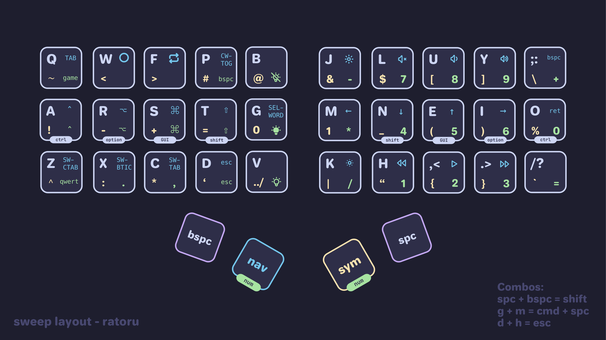
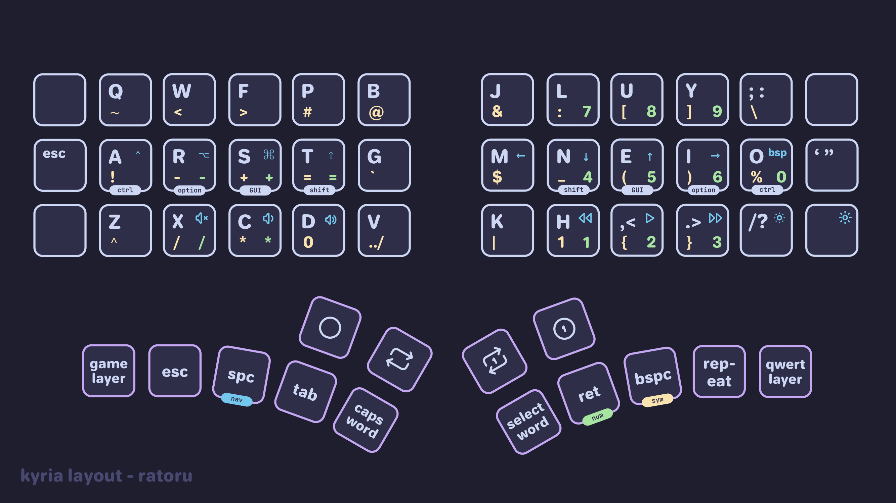
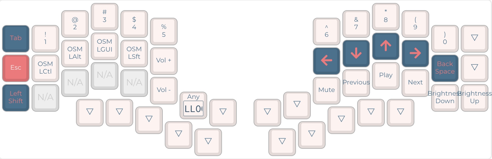
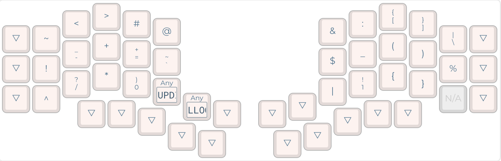
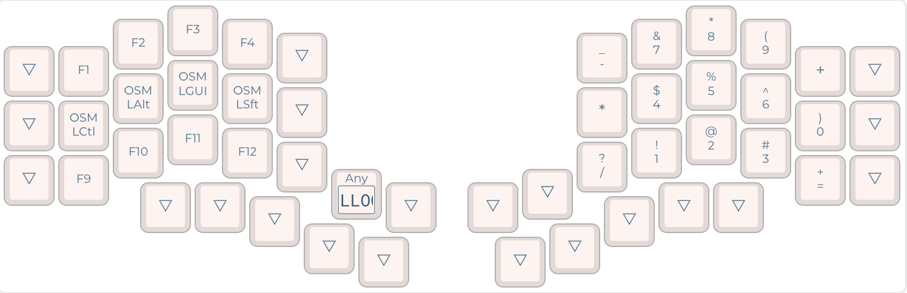
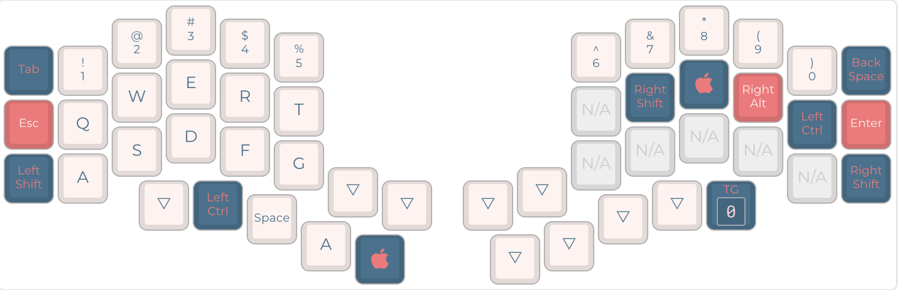
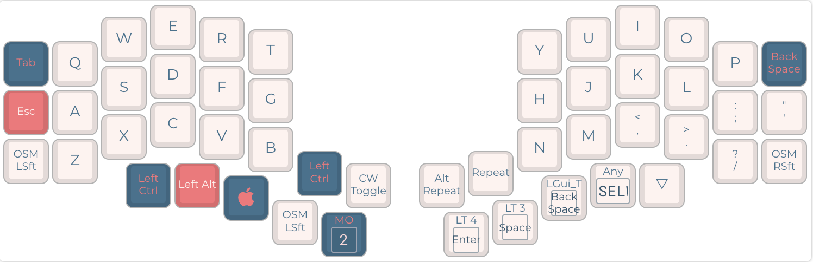

# Custom QMK Keymaps

> [!NOTE]
> My latest keymaps can be found in [ratoru/qmk_userspace](https://github.com/ratoru/qmk_userspace).
> This repo was created before QMK released the external userspace.

These are my keymaps for the [Kyria rev3](https://github.com/splitkb/kyria) and the [Aurora Sweep](https://splitkb.com/collections/keyboard-kits/products/aurora-sweep). Learn more about how and why I created them by reading [my guide](https://ratoru.com/blog/choose-the-right-base-layout).

It was heavily inspired by [Pascal Getreuer's keymap](https://github.com/getreuer/qmk-keymap). It uses a `Colemak-DH` base layer with an option to switch to `Qwerty`. I spent a lot of time trying to design a very efficient symbol layer for programming. To do so, I referred heavily to character and bigram frequencies in programming langues.

The keymap is compiled using a GitHub Action. I changed the target to `-e CONVERT_TO=liatris` in the GitHub Action since adding it in `rules.mk` did not work for me. If you have a [different controller](https://docs.qmk.fm/#/feature_converters?id=converters), you might want to remove this part in `build.yml`.

## Features

- [Caps Word](https://docs.qmk.fm/#/feature_caps_word)
- [Dynamic Macros](https://docs.qmk.fm/#/feature_dynamic_macros)
- [Word Selection](https://getreuer.info/posts/keyboards/select-word/index.html) macro
- [Swapper](https://github.com/callum-oakley/qmk_firmware/tree/master/users/callum#swapper). Sends `cmd-key`, but holds `cmd` between consecutive keypresses.
- [Layer Lock](https://getreuer.info/posts/keyboards/layer-lock/index.html) macro
- `../` key in symbol layer
- Layer keys activated by the thumbs via mod-tap.
- RGB lighting (= underglow) using `_noeeprom` functions. Uses different colors to indicate current layer. Turns off microcontroller light.
- Combos like `spc + bspc = one-shot sift`. See `combos.inc` for more info.
- Layouts for both home row mods (named `*-hrm.json`) and one-shot modifiers (named `*-osm.json`).
- For home row mods users: [timeless home row mods](https://github.com/urob/zmk-config#timeless-homerow-mods) implementation for QMK.

Note that keymap documentation might not always be up to date.

## Sweep keymap

Aurora Sweep keymap using combos and `noeeprom` RGB underglow. Can be compiled using one-shot modifiers or home row mods.

## Kyria keymap

The number of each layer does not have much real relvancy, but let's you know which key switches to which layer. These layers are still in the early stages of development.

### `Colemak-DH` base layer (0)

### Navigation layer (2)

Adapted the [Extend Layer](https://dreymar.colemak.org/layers-extend.html) for MacOS.

### Symbol layer (3)

Optimized for coding including `0` and `1`.

### Numpad layer (4)

### Gaming layer (5)

Numbers and `qwerty` row. Command keys on the right side if needed.

### Alternate `Qwerty` layer (1)

Option to switch to `Qwerty`.

## Switching between hrm and osm

I created keymaps for both because I want to try how each one feels. In order to switch the compilation target, add the right file to `build.yml`. Next, (un-)comment the corresponding `#defines` in `rules.mk`.

Note: when using timeless home row mods, combos using the home row keys won't work.

## Flashing the litaris

- Disconnect TRRS/TRS cable between the splits.
- For both of splits, do:
  - Connect your split to the computer using USB.
  - Press the reset switch of the split two times consequently so that your RP2040 based MCU will go to Bootloader Mode.
  - You must see Raspberry PI Boot Device in the output of lsusb. It's also detected as Mass Storage Device.
  - Drag and Drop (cp or copy) the .uf2 file to the RP2040 Mass Storage Device.
  - After the firmware is copied, you will see that the MCU exits Bootloader mode and Mass Storage Device is no longer present. It means that the firmware is flashed!
